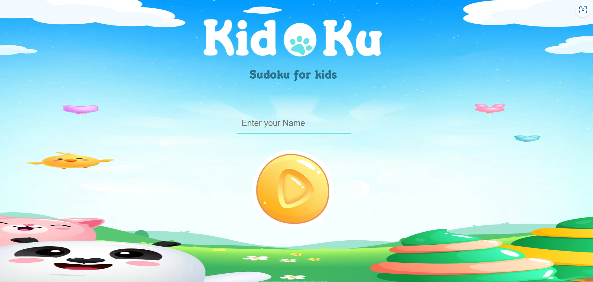
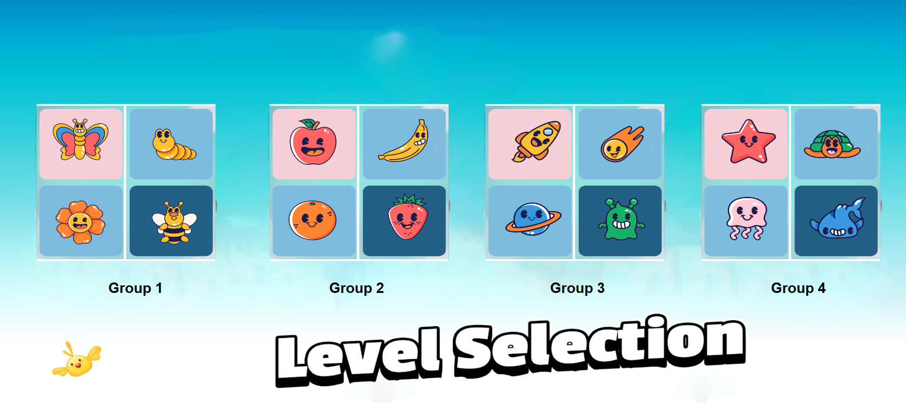
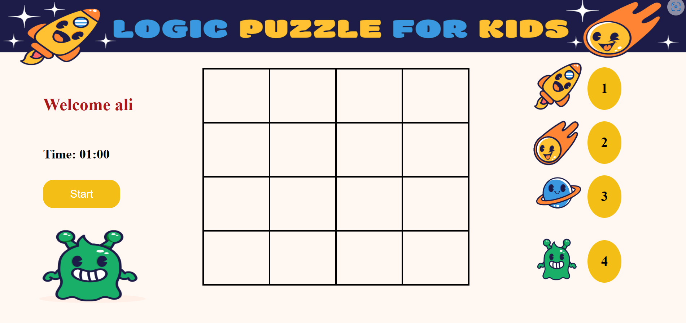

# Image Sudoku Game for Kids

This game is a kid-friendly version of Sudoku, where images replace the traditional numbers. Instead of filling in numbers, children will solve Sudoku puzzles by selecting and arranging images in a 4x4 grid. The game aims to engage children in a fun and visually stimulating way while improving their problem-solving skills.
#  Demo
- https://sudoku-game-kids.netlify.app/

## Features:
- **Child-Friendly Interface:** The game is designed with colorful and visually appealing graphics to engage and entertain children.
- **Customizable Image Selection:** The gallery page allows children to choose their preferred group of images to play with, providing a personalized gaming experience.
- **Simple Navigation:** The game provides intuitive navigation controls, allowing children to move the cursor within the grid using the four arrow keys on the keyboard.
- **Randomized Image Placement:** Each inner grid of the 4x4 table is populated with random images from the selected group, ensuring a unique puzzle layout for every gameplay session.
- **Name Entry:** The game allows children to enter their name, personalizing their gaming experience and providing a sense of ownership.
- **Problem-Solving Challenges:** By solving Sudoku puzzles using images, children can enhance their logical thinking and problem-solving skills in an engaging and interactive way.

## SCREENSHOTS
- Home Page
 
- Gallery Page
 
- Game Page
  
- Game Play
 
- Win Page
 
- GameOver Page

## Technologies Used:
- HTML
- CSS
- JavaScript